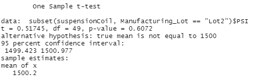

# MechaCar_Statistical_Analysis

## Linear Regression to Predict MPG

- From the result, Pr(>|t|) value as it shows the possible cofficient that can contribute to the random amount of variance of linear model. Therefore, the vehicle_length, ground_clearance (as well as Intercept) provided a non-random amount of variance to the mpg values in the dataset.

- The slope is not zero because the p-value of the linear regression is 5.35e-11 which is smaller than 0.05. So there is sufficient evidence to reject our null hypothesis.

- It can be seen that the R-squared value is 0.7149 which could be around 71% that the model can predict the mpg of MechaCar. Therefore, the model might predict the mpg of MechaCar prototypes effectively. 

## Summary Statistics on Suspension Coils 

- Total Summary
- 

- Lot Summary
- 

- Generally, from the total_summary table, the design meets the requirement that the variance of the suspension coils must not exceed 100 psi.  
- Individually, from the lot_summary table, the current manufacturing data meet this design specification for lot 1 and 2. However,lot 3 show large number in variance which exceeds the specs with 170 psi.

## T-Tests on Suspension Coils

- General

- Based on the test, the p-value from Lot 1 and 2 is higher than 0.05%. Thus, Lot 1 and 2 are NOT different from the population mean. 

- According to the test, the p-value from Lot3 is lower than 0.05%. Thus, the null hypothesis could be rejected and Lot 3 is different from population mean.

## Study Design: MechaCar vs Competition

 - I would consider cost and horsepower are metrics that people consider the most when they want to buy a car. 
 - Null hypothesis population parameter such as price/horsepower of our firm, the alternative hypothesis considers the difference of population parameter between our company and other manufacturers.
 - I would use the linear regression tests, t-test to compare the mean of each metric from multiple competitors.
 - Gathering information from other manufacturers is significant as we need it for the comparison.
